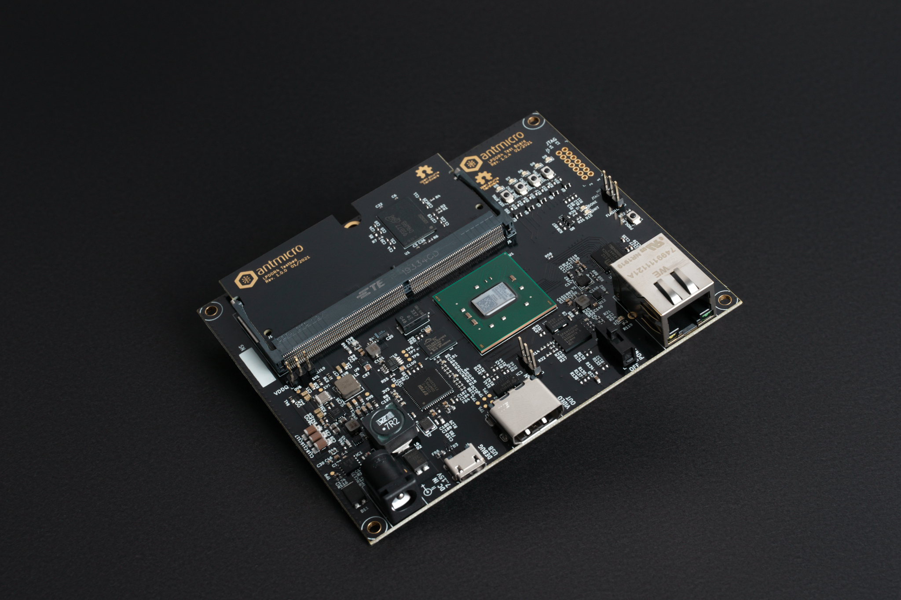

LPDDR4 Test Board
=================

The following instructions explain how to set up the board.

Board configuration
-------------------

Connect the board USB and Ethernet cables to your computer and configure the network. The board's IP address will be ``192.168.100.50`` (so you could e.g. use ``192.168.100.2/24``\ ). The ``IP_ADDRESS`` environment variable can be used to modify the board's address.
Next, generate the FPGA bitstream:

.. code-block:: sh

   export TARGET=lpddr4_test_board
   make build

The results will be located in: ``build/lpddr4_test_board/gateware/antmicro_lpddr4_test_board.bit``. To upload it, use:

.. code-block:: sh

   export TARGET=lpddr4_test_board
   make upload

.. note::

   By typing ``make`` (without ``build``\ ) LiteX will generate build files without invoking Vivado.
