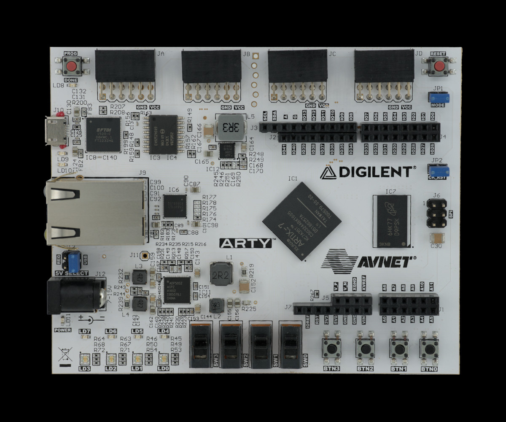

# Arty-A7 board

The [Arty-A7 board](https://reference.digilentinc.com/reference/programmable-logic/arty-a7/start) allows testing its on-board DDR3 module.
The board is designed around the Artix-7™ Field Programmable Gate Array (FPGA) from Xilinx.

:::{figure-md} arty-a7


Arty-A7 board
:::

The following instructions explain how to set up the board.

For FPGA gateware documentation for this board, refer to the [Gateware Documentation chapter](build/arty/documentation/index.rst).

## Board configuration

Connect the board USB and Ethernet cables to your computer and configure the network.
The board's default IP address is `192.168.100.50` and you need to ensure the device are registered within the same subnet (so, for example, you can use `192.168.100.2/24`).
The `IP_ADDRESS` environment variable can be used to modify the board's address.
Next, generate the FPGA bitstream:

```sh
export TARGET=arty
make build
```

```{note}
This will by default target Arty-A7 with the XC7A35TICSG324-1L FPGA. To build for XC7A100TCSG324-1,
use `make build TARGET_ARGS="--variant a7-100"`
```

The results will be located in: `build/arty/gateware/digilent_arty.bit`. 
To upload the bitstream, use:

```sh
export TARGET=arty
make upload
```

```{note}
Running `make` (without `build`) will generate build files without invoking Vivado.
```

To load the bitstream into the flash memory, use:

```sh
export TARGET=arty
make flash
```

The bitstream will be loaded from flash memory upon device power-on or after pressing the PROG button.
