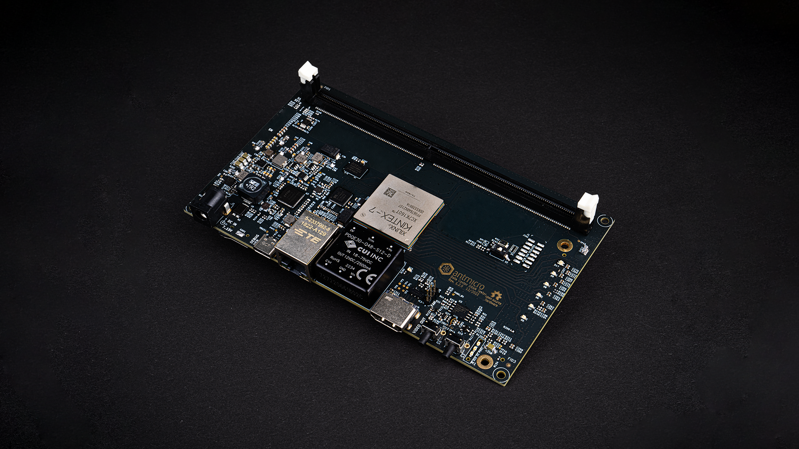
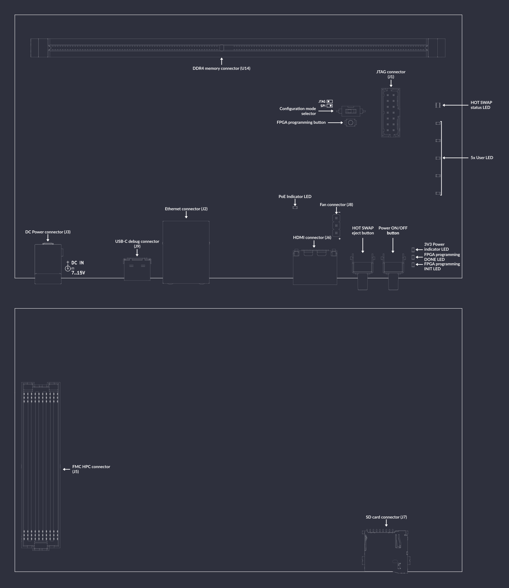

# Data Center RDIMM DDR4 Tester

:::{figure-md} data-center-rdimm-ddr4-tester


Data Center RDIMM DDR4 Tester
:::

The Data Center RDIMM DDR4 Tester is an open source hardware test platform that enables testing and experimenting with various DDR4 RDIMMs (Registered Dual In-Line Memory Module).

The hardware is open and can be found on GitHub:
<https://github.com/antmicro/rdimm-ddr4-tester>

The following instructions explain how to set up the board.

For FPGA gateware documentation for this board, refer to the [Gateware Documentation chapter](build/ddr4_datacenter_test_board/documentation/index.rst).

## IO map

A map of on-board connectors, status LEDs, control buttons and I/O interfaces is provided in {numref}`data-center-rdimm-ddr4-tester-interface-map` below.

:::{figure-md} data-center-rdimm-ddr4-tester-interface-map


DDR4 data center dram tester interface map
:::

Connectors:

* [`J3`](#data-center-dram-tester_J3) - main DC barrel jack power connector, voltage between 7-15V is supported
* [`J9`](#data-center-dram-tester_J9) - USB-C debug connector used for programming FPGA or Flash memory
* [`J1`](#data-center-dram-tester_J1) - standard 14-pin JTAG connector used for programming FPGA or Flash memory
* [`J6`](#data-center-dram-tester_J6) - HDMI connector
* [`J2`](#data-center-dram-tester_J2) - Ethernet connector used for data exchange with on-board FPGA and power supply via PoE
* [`U14`](#data-center-dram-tester_U14) - 288-pin RDIMM connector for connecting DDR4 memory modules
* [`J8`](#data-center-dram-tester_J8) - optional 5V fan connector
* [`J7`](#data-center-dram-tester_J7) - socket for SD card
* [`J5`](#data-center-dram-tester_J5) - FMC HPC connector reserved for future use

Switches and buttons:

* Power ON/OFF button [`S3`](#data-center-dram-tester_S3) - push button to power up the device, hold for 8s to turn off the device
* FPGA programming button [`PROG_B1`](#data-center-dram-tester_PROG_B1) - push button to start programming from Flash
* Configuration mode selector [`S2`](#data-center-dram-tester_S2) - Switch left/right to specify SPI/JTAG programming mode
* HOT SWAP eject button [`S1`](#data-center-dram-tester_S1) - reserved for future use to turn off DDR memory and allow hot swapping it

LEDs:

* 3V3 Power indicator [`PWR1`](#data-center-dram-tester_PWR1) - indicates presence of stabilized 3.3V voltage
* PoE indicator [`D15`](#data-center-dram-tester_D15) - indicates negotiated PoE voltage supply
* FPGA programming INIT [`D10`](#data-center-dram-tester_D10) - indicates current FPGA configuration state
* FPGA programming DONE [`D1`](#data-center-dram-tester_D1) - indicates completion of FPGA programming
* HOT SWAP status [`D17`](#data-center-dram-tester_D17) - RGY LED indicating status of hot swap process
* 5x User ([`D5`](#data-center-dram-tester_D5), [`D6`](#data-center-dram-tester_D6), [`D7`](#data-center-dram-tester_D7), [`D8`](#data-center-dram-tester_D8), [`D9`](#data-center-dram-tester_D9)) - user-configurable LEDs

## Board configuration

Connect power supply (7-15VDC) to [`J3`](#data-center-dram-tester_J3) barrel jack.
Then connect the board USB cable ([`J9`](#data-center-dram-tester_J9)) and Ethernet cable ([`J2`](#data-center-dram-tester_J2)) to your computer and insert the memory module to the socket [`U14`](#data-center-dram-tester_U14).
To turn the board on, use power switch [`S3`](#data-center-dram-tester_S3).

After power is up, configure the network.
The board's default IP address is `192.168.100.50` and you need to ensure the device are registered within the same subnet (so, for example, you can use `192.168.100.2/24`).
The `IP_ADDRESS` environment variable can be used to modify the board's address.

Next, generate the FPGA bitstream:

```sh
export TARGET=ddr4_datacenter_test_board
make build
```

```{note}
Running `make` (without `build`) will generate build files without invoking Vivado.
```

The results will be located in: `build/ddr4_datacenter_test_board/gateware/antmicro_datacenter_ddr4_test_board.bit`. 
To upload the bitstream, use:

```sh
export TARGET=ddr4_datacenter_test_board
make upload
```

To save the bitstream in flash memory, use:

```sh
export TARGET=ddr4_datacenter_test_board
make flash
```

A JTAG/SPI switch [`S2`](#data-center-rdimm-ddr4-tester_S2) on the right side of the board (near the JTAG connector) defines whether the bitstream is loaded via JTAG or SPI Flash memory.

Bitstream will be loaded from flash memory upon device power-on or after pressing the [`PROG_B1`](#data-center-dram-tester_PROG_B1) button.
