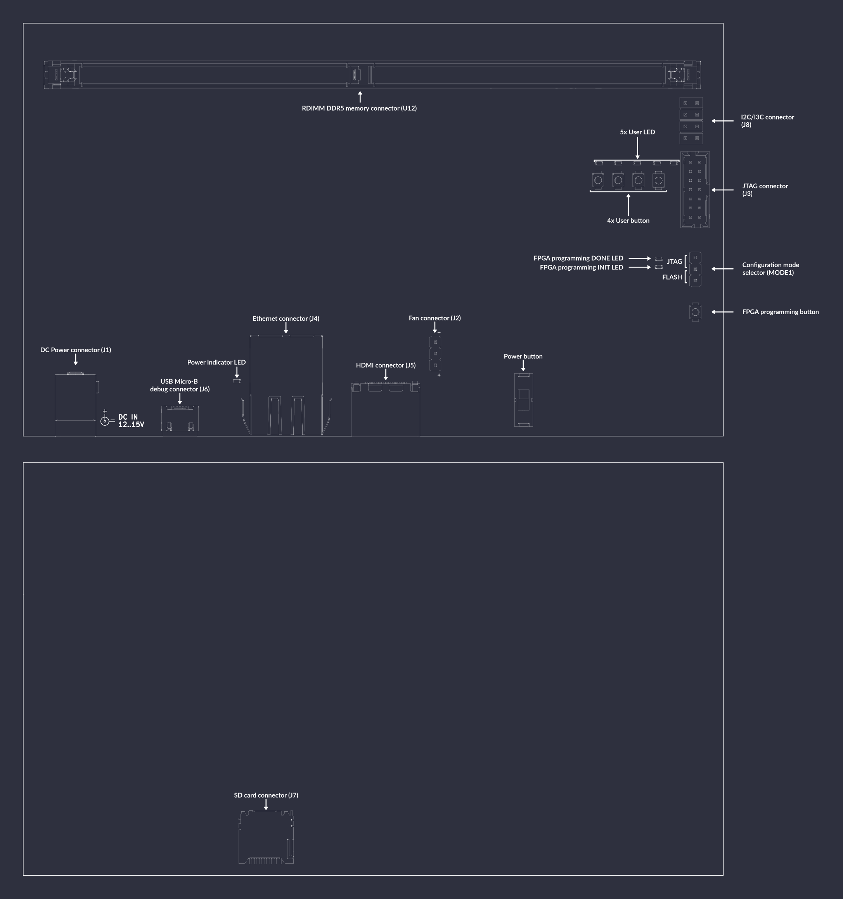

# Data Center RDIMM DDR5 Tester

```{image} images/datacenter-rdimm-ddr5-tester.png
```

The Data Center RDIMM DDR5 Tester is an open source hardware test platform that enables testing and experimenting with various DDR5 RDIMMs (Registered Dual In-Line Memory Module).

The hardware is open and can be found on GitHub:
<https://github.com/antmicro/ddr5-tester/>

The following instructions explain how to set up the board.

## IO map
A map of on-board connectors, status LEDs, control buttons and I/O interfaces is provided below.

:::{figure-md}


DDR5 tester interface map
:::

Connectors:
* [`J1`](#ddr5-tester_J1) - main DC barrel jack power connector, voltage between 12-15V is supported
* [`J6`](#ddr5-tester_J6) - USB Micro-B debug connector used for programming FPGA or Flash memory
* [`J3`](#ddr5-tester_J3) - standard 14-pin JTAG connector used for programming FPGA or Flash memory
* [`J5`](#ddr5-tester_J5) - HDMI connector
* [`J4`](#ddr5-tester_J4) - Ethernet connector used for data exchange with on-board FPGA
* [`U12`](#ddr5-tester_U12) - 288-pin RDIMM connector for connecting DDR5 memory modules
* [`MODE1`](#ddr5-tester_MODE1) - configuration mode selector, short proper pins with jumper to specify programming mode
* [`J2`](#ddr5-tester_J2) - optional 5V fan connector
* [`J7`](#ddr5-tester_J7) - socket for SD card
* [`J8`](#ddr5-tester_J8) - 2.54mm goldpin connector with exposed I2C and I3C signals

Switches and buttons:
* Power ON/OFF button [`S1`](#ddr5-tester_S1) - swipe up to power up a device, swipe down to turn the device off
* FPGA programming button [`PROG_B1`](#ddr5-tester_PROG_B1) - push button to start programming from Flash
* 4x User button ([`PROG_B2`](#ddr5-tester_PROG_B2), [`PROG_B3`](#ddr5-tester_PROG_B3), [`PROG_B4`](#ddr5-tester_PROG_B4), [`PROG_B5`](#ddr5-tester_PROG_B5)) - buttons for user's definition

LEDs:
* 3V3 Power indicator [`PWR1`](#ddr5-tester_PWR1) - indicates presence of stabilized 3.3V voltage
* FPGA programming INIT [`D6`](#ddr5-tester_D6) - indicates current FPGA configuration state
* FPGA programming DONE [`D5`](#ddr5-tester_D5) - indicates completion of FPGA programming
* 5x User ([`D7`](#ddr5-tester_D7), [`D8`](#ddr5-tester_D8), [`D9`](#ddr5-tester_D9), [`D10`](#ddr5-tester_D10), [`D11`](#ddr5-tester_D11)) - LEDs for user's definition

## Rowhammer Tester Target Configuration

Connect power supply (12-15VDC) to [`J1`](#ddr5-tester_J1) barrel jack. Then connect the board USB cable ([`J6`](#ddr5-tester_J6)) and Ethernet cable ([`J4`](#ddr5-tester_J4)) to your computer and insert the memory module to the socket [`U12`](#ddr5-tester_U12).
To turn the board on, use power switch [`S1`](#ddr5-tester_S1). 
After power is up, configure the network. The board's IP address will be `192.168.100.50` (so you could e.g. use `192.168.100.2/24`). The `IP_ADDRESS` environment variable can be used to modify the board's address.
Next, generate the FPGA bitstream:

```sh
export TARGET=ddr5_tester
make build TARGET_ARGS="--l2-size 256 --build --iodelay-clk-freq 400e6 --bios-lto --rw-bios --module MTC10F1084S1RC --no-sdram-hw-test"
```

```{note}
--l2-size 256 sets L2 cache size to 256 bytes

--no-sdram-hw-test disables hw accelerated memory test
```

```{note}
By typing `make` (without `build`) LiteX will generate build files without invoking Vivado.
```

The results will be located in: `build/ddr5_tester/gateware/antmicro_ddr5_tester.bit`. To upload it, use:

```sh
export TARGET=ddr5_tester
make upload
```

To save bitstream in flash memory, use:

```sh
export TARGET=ddr5_tester
make flash
```

```{warning}
There is a JTAG/SPI switch ([`MODE1`](#ddr5-tester_MODE1)) on the right side of the board.
Unless it's set to the SPI setting, the FPGA will load the bitstream received via JTAG ([`J3`](#ddr5-tester_J3)).
```

Bitstream will be loaded from flash memory upon device power-on or after a [`PROG_B1`](#ddr5-tester_PROG_B1) button press.

## Linux Target Configuration

There's another RDIMM DDR5 Tester tagret provided.
The `ddr5_tester_linux` is a linux capable target (**with no rowhammer tester**) that allows you to define custom DDR5 tester module utilizing linux-based software.

### Base DDR5 Tester Linux Options

The `ddr5_tester_linux` is configured via specifying **TARGET_ARGS** variable.
The required arguments for the `ddr5_tester_linux` are:

|          Option          |                                                          Documentation                                                          |
|:------------------------:|:-------------------------------------------------------------------------------------------------------------------------------:|
|         `--build`        | When specified will invoke synthesis and hardware analysis tool (Vivado by default).<br /> Will produce programmable bitstream. |
|        `--l2-size`       |                                                   Specifies the L2 cache size.                                                  |
|   `--iodelay-clk-freq`   |                                                     IODELAY clock frequency.                                                    |
|        `--module`        |                                                   The DDR5 module to be used.                                                   |
| `--with-wishbone-memory` |                             VexRiscV SMP specific option.<br /> Disables native LiteDRAM interface.                             |
|  `--wishbone-force-32b`  |                         VexRiscV SMP specific option.<br /> Forces the wishbone bus to be 32 bits wide.                         |


Additionally, **etherbone** or **ethernet** can be set up with either:
### Ethernet Options

|         Option        |                          Documentation                         |
|:---------------------:|:--------------------------------------------------------------:|
|   `--with-ethernet`   |             Sets up ethernet for DDR5 Tester board.            |
| `--remote-ip-address` | The IP address of the remote machine connected to DDR5 Tester. |
|  `--local-ip-address` |                Local (DDR5 Tester's) IP address.               |

### Etherbone Options

|       Option       |               Documentation               |
|:------------------:|:-----------------------------------------:|
| `--with-etherbone` |  Sets up ethernet for DDR5 Tester board.  |
|   `--ip-address`   |  IP address to be used for the etherbone. |
|   `--mac-address`  | MAC address to be used for the etherbone. |


### Building RDIMM DDR5 Tester Linux Target

After having configured the RDIMM DDR5 Tester Linux, the target can be build with `make build` Makefile target.
Use example of DDR5 Tester Linux Target with ethernet configured:

```bash
make build TARGET=ddr5_tester_linux TARGET_ARGS="--build --l2-size 256 --iodelay-clk-freq 400e6 --module MTC10F1084S1RC --with-wishbone-memory --wishbone-force-32b --with-ethernet --remote-ip-address 192.168.100.100 --local-ip-address 192.168.100.50"
```

### Interacting with RDIMM DDR5 Tester Linux Target

First, load the bitstream onto the RDIMM DDR5 Tester with the help of the OpenFPGALoader:

```bash
openFPGALoader --board antmicro_ddr5_tester build/ddr5_tester_linux/gateware/antmicro_ddr5_tester.bit --freq 3e6
```

In order to connect to the board, assign IP Address -- `192.168.100.100` -- to the ethernet interface that is plugged to the DDR5 Tester board and set up the device if needed.
For example by:

```bash
ip addr add 192.168.100.100/24 dev $ETH
ip link set dev $ETH up
```
Where **ETH** is the name of your ethernet interface.

When the ethernet interface has been set up correctly, you may access the BIOS console on the DDR5 Tester with:

```bash
picocom -b 115200 /dev/ttyUSB2
```

### Setting up TFTP Server

From this this point, several linux boot methods can be invoked but booting via ethernet is recommended.
In order to enable netboot, the TFTP server needs to be set up first.

```{note}
Running TFTP server varies between distributions, this can mean different TFTP implementation name and a different location of the configuration file.
```

As an example, here's a quick guide on how to configure TFTP server for Arch Linux:

Firstly, if not equipped already, get an implementation of a TFTP server, for example:

```bash
pacman -S tftp-hpa
```

The TFTP server is configured via a `/etc/conf.d/tftpd` file, here's a suggested configuration for the DDR5 Tester Linux boot process:

```bash
TFTP_USERNAME="tftp"
TFTPD_OPTIONS="--secure"
TFTP_DIRECTORY="/srv/tftp"
TFTP_ADDRESS="192.168.100.100:69"
```

The **TFTP_ADDRESS** is the specified **--remote-ip-address** whilst building the target and the port is the default one for the TFTP server.
The **TFTP_DIRECTORY** is the TFTP's root directory.

Then, the TFTP service needs to be started:

```bash
systemctl start tftpd
```

To check if the TFTP sever has been set up properly, one may run:

```bash
cd /srv/tftp/ && echo "TEST TFTP SERVER" > test

cd ~/ && tftp 192.168.100.100 -c get test
```

The **test** file should appear in the home directory with "TEST TFTP SERVER" contents.

### Booting Linux on RDIMM DDR5 Tester Linux Target

You will need the following binaries:
- Linux kernel Image
- Compiled devicetree
- Opensbi's `fw_jump.bin`
- rootfs.cpio

All of those can be obtained with the use of provided `buildroot_ext` buildroot external configuration.
To build binaries with buildroot run:

```bash
git clone --single-branch -b 2023.05.x https://github.com/buildroot/buildroot.git
pushd buildroot
make BR2_EXTERNAL="$(pwd)/../buildroot_ext" ddr5_vexriscv_defconfig
```

Then, transfer the binaries to the TFTP root directory:

```bash
mv buildroot/output/images/* /srv/tftp/
mv /srv/tftp/fw_jump.bin /srv/tftp/opensbi.bin
```

The address map of the binaries alongside boot args can be contained within the **boot.json** file, for example:

```json
{
    "/srv/tftp/Image":        "0x40000000",
    "/srv/tftp/rv32.dtb":     "0x40ef0000",
    "/srv/tftp/rootfs.cpio":  "0x42000000",
    "/srv/tftp/opensbi.bin":  "0x40f00000",
    "bootargs": {
        "r1":   "0x00000000",
        "r2":   "0x40ef0000",
        "r3":   "0x00000000",
        "addr": "0x40f00000"
    }
```


Having placed linux boot binaries in the TFTP's root directory with `boot.json`, the netboot can be invoked from BIOS console with:

```bash
netboot /srv/tftp/boot.json
```

Upon successful execution a similar log will be printed:

```
litex> netboot /srv/tftp/boot.json
Booting from network...
Local IP: 192.168.100.50
Remote IP: 192.168.100.100
Booting from /srv/tftp/boot.json (JSON)...
Copying /srv/tftp/Image to 0x40000000... (7395804 bytes)
Copying /srv/tftp/rv32.dtb to 0x40ef0000... (2463 bytes)
Copying /srv/tftp/rootfs.cpio to 0x42000000... (22128128 bytes)
Copying /srv/tftp/opensbi.bin to 0x40f00000... (1007056 bytes)
Executing booted program at 0x40f00000

--============= Liftoff! ===============--
```

Then, the Opensbi and Linux boot log should follow:

```
OpenSBI v1.3-24-g84c6dc1
   ____                    _____ ____ _____
  / __ \                  / ____|  _ \_   _|
 | |  | |_ __   ___ _ __ | (___ | |_) || |
 | |  | | '_ \ / _ \ '_ \ \___ \|  _ < | |
 | |__| | |_) |  __/ | | |____) | |_) || |_
  \____/| .__/ \___|_| |_|_____/|____/_____|
        | |
        |_|

Platform Name             : LiteX / VexRiscv-SMP
Platform Features         : medeleg
Platform HART Count       : 8
Platform IPI Device       : aclint-mswi
Platform Timer Device     : aclint-mtimer @ 100000000Hz
Platform Console Device   : litex_uart
(...)
[    0.000000] Linux version 5.11.0 (riscv32-buildroot-linux-gnu-gcc.br_real (Buildroot 2023.05.2-154-g787a633711) 11.4.0, GNU ld (GNU Binutils) 2.38) #2 SMP Mon Sep 25 10:52:22 CEST 2023
[    0.000000] earlycon: sbi0 at I/O port 0x0 (options '')
[    0.000000] printk: bootconsole [sbi0] enabled
(...)
```

At the very end you should be greeted with:

```
Welcome to Buildroot
buildroot login: root
             _     _
            | |   (_)
            | |    _ _ __  _   ___  __
            | |   | | '_ \| | | \ \/ /
            | |___| | | | | |_| |>  <
            \_____/_|_| |_|\__,_/_/\_\
                      _ _   _
                     (_) | | |
            __      ___| |_| |__
            \ \ /\ / / | __| '_ \
             \ V  V /| | |_| | | |
              \_/\_/ |_|\__|_| |_|
            __________________ _____
            |  _  \  _  \ ___ \  ___|
            | | | | | | | |_/ /___ \
            | | | | | | |    /    \ \
            | |/ /| |/ /| |\ \/\__/ /
            |___/ |___/ \_| \_\____/

  32-bit RISC-V Linux running on DDR5 Tester.

login[65]: root login on 'console'
```

## Simulation

The simulation is based on a DDR5 DRAM model ([sdram_simulation_model.py](../../third_party/litedram/litedram/phy/ddr5/sdram_simulation_model.py)) and a DDR5 PHY simulation model ([simphy.py](../../third_party/litedram/litedram/phy/ddr5/simphy.py)). These two models are used by the SoC simulation model ([simsoc.py](../../third_party/litedram/litedram/phy/ddr5/simsoc.py)).

The simulation can be started with:

```sh
python3 third_party/litedram/litedram/phy/ddr5/simsoc.py --no-masked-write --with-sub-channels --dq-dqs-ratio 4 --modules-in-rank 1 --log-level error --skip-csca --skip-reset-seq --skip-mrs-seq --with-prompt --l2-size 256 --uart-name serial
```
