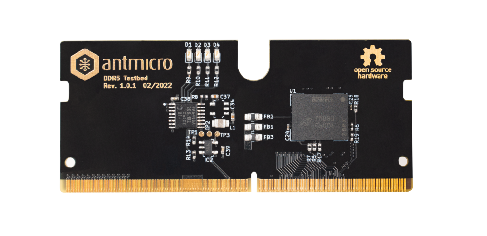

# DDR5 Test Bed

:::{figure-md} ddr5-test-bed


DDR5 Test Bed
:::

This accessory allows interfacing with a single DDR5 ICs using the [LPDDR4 Test Board](lpddr4_test_board).
The hardware design of the DDR5 Test Bed is released to GitHub (<https://github.com/antmicro/ddr5-testbed>) as open source hardware.
The hardware design of the DDR5 Test Bed includes a single Micron [MT60B2G8HB-48B:A](https://www.farnell.com/datasheets/3704816.pdf) 16Gb DRAM.
The DDR5 Test Bed exposes only one memory channel (channel A) to the FPGA located on a matching test board.

The DDR5 IC needs to be soldered to a custom [DDR5 Testbed](https://github.com/antmicro/ddr5-testbed/) PCB which is available on GitHub as open source hardware.

Since the LPDDR4 Test Board offers a limited number of IO pins used for interfacing with the testbed, only one channel of a single DDR5 memory IC located on the Test Bed is accessible for testing.

```{warning}
The DDR5 Test Bed has a form factor that is mechanically compatible with SO-DIMM DDR4 sockets.
The pinout of the DDR5 Test Bed does not match SO-DIMM DDR4 specification so it cannot be used in systems supporting off-the-shelf SO-DIMM DDR4 memories.
```
