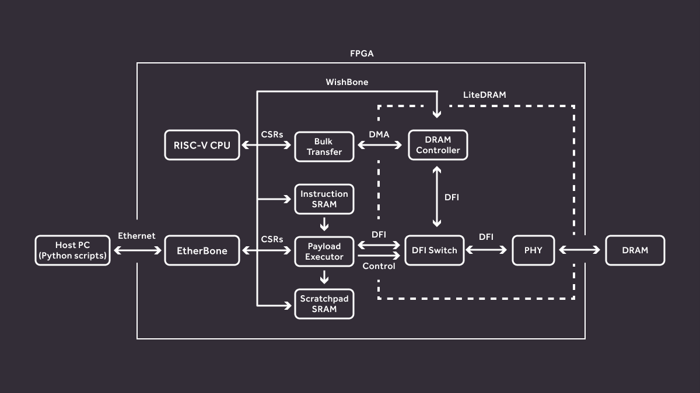

# Project overview

The aim of this project is to provide a platform for testing [DRAM vulnerability to rowhammer attacks](https://users.ece.cmu.edu/~yoonguk/papers/kim-isca14.pdf).

This suite can be run on real hardware (FPGAs) or in a simulation mode.
As the rowhammer attack exploits physical properties of cells in DRAM (draining charges), no bit flips can be observed in simulation mode (see [Simulation section](#simulation)).
However, the simulation mode is useful for testing command sequences during development.

The Makefile can be configured using environmental variables to modify the network configuration used and to select the target.
Currently, 6 boards are supported, each targeting a different memory type:

:::

| Board                         | Memory type      | TARGET                       |
|-------------------------------|------------------|------------------------------|
| Arty A7                       | DDR3             | `arty`                       |
| ZCU104                        | DDR4 (SO-DIMM)   | `zcu104`                     |
| Data Center RDIMM DDR4 Tester | DDR4 (RDIMM)     | `ddr4_datacenter_test_board` |
| LPDDR4 Test Board             | LPDDR4 (SO-DIMM) | `lpddr4_test_board`          |
| Data Center RDIMM DDR5 Tester | DDR5 (RDIMM)     | `ddr5_tester`                |
| DDR5 Test Board               | DDR5 (SO-DIMM)   | `ddr5_test_board`            |

For board-specific instructions refer to [Arty A7](arty.md), [ZCU104](zcu104.md), [DDR4 Datacenter DRAM Tester](ddr4_datacenter_dram_tester.md), [LPDDR4 Test Board](lpddr4_tb.md), [DDR5 Tester](ddr5_tester.md) and [DDR5 Test Board](ddr5_test_board.md) chapters.

Read more about particular aspects of the framework in dedicated blog articles:

* [Rowhammer tester platform overview](https://antmicro.com/blog/2021/08/open-source-ddr-test-framework-for-rowhammer/)
* [LPDDR4 Test Board](https://antmicro.com/blog/2021/04/lpddr4-test-platform/)
* [Data Center RDIMM DDR4 Tester](https://antmicro.com/blog/2021/12/open-source-data-center-rowhammer-tester/)
* [Data Center RDIMM DDR5 Tester](https://antmicro.com/blog/2023/07/open-source-data-center-rdimm-ddr5-tester-for-memory-vulnerability-research/)
* [SO-DIMM DDR5 Tester](https://antmicro.com/blog/2024/02/versatile-so-dimm-lpddr5-rowhammer-testing-platform/)

## Tester suite architecture

This section provides an overview of the Rowhammer tester suite architecture.

System architecture is presented in {numref}`tester-architecture` below:

:::{figure-md} tester-architecture

Rowhammer tester suite architecture
:::

The DRAM is connected to [LiteDRAM](https://github.com/enjoy-digital/litedram), which provides swappable PHYs and a DRAM controller implementation.

In the default bulk transfer mode, the LiteDRAM controller is connected to PHY and ensures correct DRAM traffic.
Bulk transfers can be controlled using dedicated Control & Status Registers (CSRs) and use LiteDRAM DMA to ensure fast operation.

The Payload Executor allows executing a user-provided sequence of commands.
It temporarily disconnects the DRAM controller from PHY; executes the instructions stored in the SRAM memory, translating them into DFI commands and finally reconnects the DRAM controller.

The application side consists of a set of Python scripts communicating with the FPGA using the LiteX EtherBone bridge.

## Documentation structure

* [Introduction](introduction.md) - (current chapter) provides a description of the rowhammer tester suite and its architecture
* [Installation and setup](setup.md) - an installation guide and instructions on bitstream packaging and network adapter setup
* Board configuration and control
    * [General board configuration and control](board_control.md) - general board configuration and control instructions, including simulation setups
    * Board-specific chapters:
        * [Arty-A7](arty.md)
        * [LPDDR4 Test Board](lpddr4_test_board.md)
        * [LPDDR4 Test Board with DDR5 Testbed](lpddr4_test_board_with_ddr5_testbed.md)
        * [Data Center RDIMM DDR4 Tester](data_center_rdimm_ddr4_tester.md)
        * [Data Center RDIMM DDR5 Tester](data_center_rdimm_ddr5_tester.md)
        * [SO-DIMM DDR5 Tester](so_dimm_ddr5_tester.md)
        * [ZCU104](zcu104.md)
* [Performing attacks (hammering)](hammering.md) - instructions for performing rowhammer attacks, examples, DRAM config guide and Python utility overview
* [Result visualization](visualization.md) - instructions for generating plots and visualizations
* [Test-writing playbook](playbook.md) - guide for using dedicated Python classes and scripts for writing rowhammer-related tests
* Digital design- FPGA digital design documented per-board:
    * [Arty-A7 board](build/arty/documentation/index.rst)
    * [LPDDR4 Test Board](build/lpddr4_test_board/documentation/index.rst)
    * [Data Center RDIMM DDR4 Tester](build/ddr4_datacenter_test_board/documentation/index.rst)
    * [Data Center RDIMM DDR5 Tester](build/ddr5_test_board/documentation/index.rst)
    * [SO-DIMM DDR5 Tester](build/ddr5_tester/documentation/index.rst)
    * [ZCU104 board](build/zcu104/documentation/index.rst)
