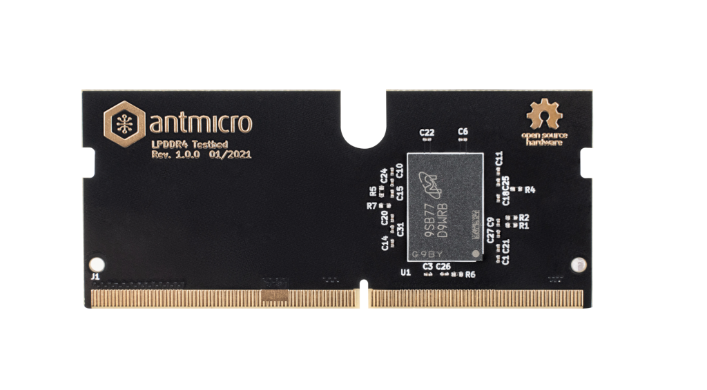

# LPDDR4 Test Bed

:::{figure-md} lpddr4-test-bed


LPDDR4 Test Bed
:::

This accessory allows to interface with a single LPDDR4 ICs using the [LPDDR4 Test Board](lpddr4_test_board).
The hardware design of the LPDDR4 Test Bed is released to GitHub (<https://github.com/antmicro/lpddr4-testbed>) as open source hardware.
The hardware design includes Micron [MT53E1G32D2NP-046](https://www.micron.com/products/dram/lpdram/part-catalog/mt53e1g32d2np-046-wt).
The LPDDR4 Testbed exposes only one memory channel (channel A) to the FPGA located on a matching test board.

```{warning}
The LPDDR4 Test Bed has a form factor that is mechanically compatible with SO-DIMM DDR4 sockets. 
The pinout of the LPDDR4 Test Bed does not match SO-DIMM DDR4 specification so it cannot be used in systems supporting off-the-shelf SO-DIMM DDR4 memories.
```
