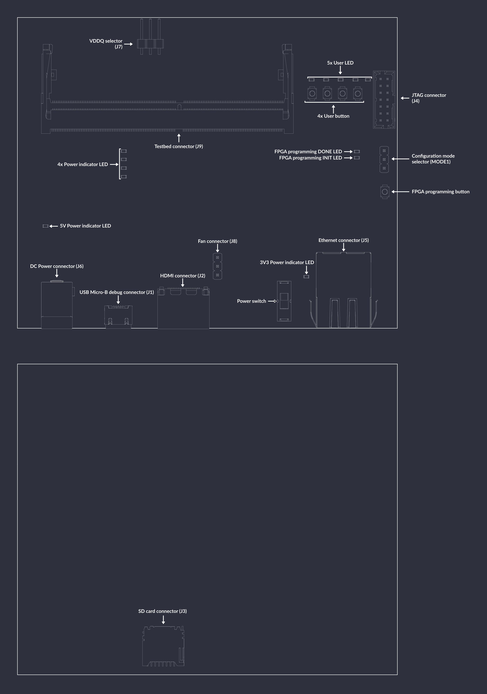

# LPDDR4 Test Board

```{image} images/lpddr4-test-board.jpg
```

LPDDR4 Test Board is a platform developed by Antmicro for testing LPDDR4 memory.
It uses Xilinx Kintex-7 FPGA (XC7K70T-FBG484) and by default includes a custom SO-DIMM module with Micron's MT53E256M16D1 LPDDR4 DRAM.

The hardware is open and can be found on GitHub:

- Test board: <https://github.com/antmicro/lpddr4-test-board>
- Testbed: <https://github.com/antmicro/lpddr4-testbed>

## IO map
A map of on-board connectors, status LEDs, control buttons and I/O interfaces is provided below.

:::{figure-md}


LPDDR4 test board interface map
:::

Connectors:
* [`J6`](#lpddr4-test-board_J6) - main DC barrel jack power connector, voltage between 7-15V is supported
* [`J1`](#lpddr4-test-board_J1) - USB Micro-B debug connector used for programming FPGA or Flash memory
* [`J4`](#lpddr4-test-board_J4) - standard 14-pin JTAG connector used for programming FPGA or Flash memory
* [`J2`](#lpddr4-test-board_J2) - HDMI connector
* [`J5`](#lpddr4-test-board_J5) - Ethernet connector used for data exchange with on-board FPGA
* [`J9`](#lpddr4-test-board_J9) - 260-pin SO-DIMM connector for connecting LPDDR4 memory
* [`MODE1`](#lpddr4-test-board_MODE1) - configuration mode selector, short proper pins with jumper to specify programming mode
* [`J7`](#lpddr4-test-board_J7) - VDDQ selector used for specifying value of VDDQ voltage
* [`J8`](#lpddr4-test-board_J8) - optional 5V fan connector
* [`J3`](#lpddr4-test-board_J3) - socket for SD card

Switches and buttons:
* Power switch [`S1`](#lpddr4-test-board_S1) - swipe up to power up a device, swipe down to turn the device off
* FPGA programming button [`PROG_B1`](#lpddr4-test-board_PROG_B1) - push to start programming from Flash
* 4x User button ([`USR_BTN1`](#lpddr4-test-board_USR_BTN1),[`USR_BTN2`](#lpddr4-test-board_USR_BTN2),[`USR_BTN3`](#lpddr4-test-board_USR_BTN3),[`USR_BTN4`](#lpddr4-test-board_USR_BTN4)) - buttons for user's definition

LEDs:
* Power indicators ([`PWR1`](#lpddr4-test-board_PWR1), [`PWR2`](#lpddr4-test-board_PWR2), [`PWR3`](#lpddr4-test-board_PWR3), [`PWR4`](#lpddr4-test-board_PWR4), [`PWR5`](#lpddr4-test-board_PWR5), [`PWR6`](#lpddr4-test-board_PWR6)) - indicates presence of stabilized voltages: 5V, 3V3, 1V8, 1V2, 1V1, 1V0
* FPGA programming INIT [`D9`](#lpddr4-test-board_D9) - indicates current FPGA configuration state
* FPGA programming DONE [`D8`](#lpddr4-test-board_D8) - indicates completion of FPGA programming
* 5x User ([`D1`](#lpddr4-test-board_D1), [`D2`](#lpddr4-test-board_D2), [`D3`](#lpddr4-test-board_D3), [`D5`](#lpddr4-test-board_D5), [`D6`](#lpddr4-test-board_D6)) - LEDs for user's definition

## Board configuration

First insert the LPDDR4 DRAM module into the socket [`J9`](#lpddr4-test-board_J9) and make sure that jumpers are set in correct positions:

- VDDQ switch ([`J7`](#lpddr4-test-board_J7)) should be set in position 1V1
- [`MODE1`](#lpddr4-test-board_MODE1) switch should be set in position FLASH

Connect power supply (7-15VDC) to [`J6`](#lpddr4-test-board_J6) barrel jack.
Then connect the board's USB-C [`J1`](#lpddr4-test-board_J1) and Ethernet [`J5`](#lpddr4-test-board_J5) interfaces to your computer.
Turn the board on using power switch [`S1`](#lpddr4-test-board_S1).
Then configure the network. The board's IP address will be `192.168.100.50` (so you could e.g. use `192.168.100.2/24`). The `IP_ADDRESS` environment variable can be used to modify the board's address.
Next, generate the FPGA bitstream:

```sh
export TARGET=lpddr4_test_board
make build
```

The results will be located in: `build/lpddr4_test_board/gateware/antmicro_lpddr4_test_board.bit`. To upload it, use:

```sh
export TARGET=lpddr4_test_board
make upload
```

```{note}
By typing `make` (without `build`) LiteX will generate build files without invoking Vivado.
```

To save bitstream in flash memory, use:

```sh
export TARGET=lpddr4_test_board
make flash
```

There is a JTAG/FLASH jumper [`MODE1`](#lpddr4-test-board_MODE1) on the right side of the board.
It defines whether the bitstream will be loaded via JTAG or FLASH memory.

Bitstream will be loaded from flash memory upon device power-on or after a FPGA programming button ([`PROG_B1`](#lpddr4-test-board_PROG_B1)) press.
