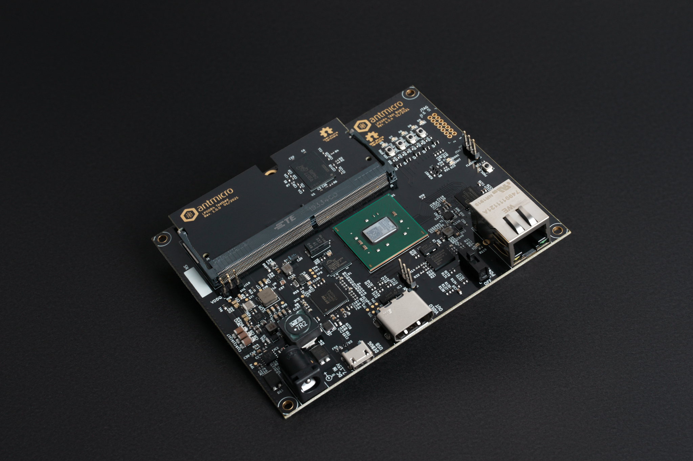

# LPDDR4 Test Board with DDR5 Testbed

:::{figure-md} lpddr4-test-board-with-ddr5-testbed


LPDDR4 Test Board with DDR5 Testbed
:::

The DDR5 test board is an open source hardware test platform that enables testing and experimenting with various x4/x8 DDR5 modules embedded on a DDR5 testbed.

The hardware is open and can be found on GitHub:

- Main board <https://github.com/antmicro/lpddr4-test-board/>
- Testbed <https://github.com/antmicro/ddr5-testbed/>

The following instructions explain how to set up the board.

## Board configuration

Connect power supply (7-15VDC) to [`J6`](#lpddr4-test-board_J6) barrel jack.
Then connect the board's USB-C [`J1`](#lpddr4-test-board_J1) and Ethernet [`J5`](#lpddr4-test-board_J5) interfaces to your computer.
Turn the board on using power switch [`S1`](#lpddr4-test-board_S1).
Then configure the network.
The board's default IP address is `192.168.100.50` and you need to ensure the device are registered within the same subnet (so, for example, you can use `192.168.100.2/24`).
The `IP_ADDRESS` environment variable can be used to modify the board's address.
Next, generate the FPGA bitstream:

```sh
export TARGET=ddr5_test_board
make build TARGET_ARGS="--l2-size 256 --build --iodelay-clk-freq 400e6 --bios-lto --rw-bios --no-sdram-hw-test"
```

```{note}
`--l2-size 256` sets L2 cache size to 256 bytes

`--no-sdram-hw-test` disables hw accelerated memory test
```

```{note}
Running `make` (without `build`) will generate build files without invoking Vivado.
```

The results will be located in: `build/ddr5_test_board/gateware/antmicro_ddr5_test_board.bit`.
To upload the bitstream, use:

```sh
export TARGET=ddr5_test_board
make upload
```

To save bitstream in flash memory, use:

```sh
export TARGET=ddr5_test_board
make flash
```

```{warning}
There is a JTAG/FLASH jumper [`MODE1`](#lpddr4-test-board_MODE1) on the right-hand side of the board.
Unless it's set to the FLASH setting, the FPGA will load the bitstream received via JTAG ([`J4`](#lpddr4-test-board_J4)).
```

Bitstream will be loaded from flash memory upon device power-on or after pressing the [`PROG_B1`](#lpddr4-test-board_PROG_B1) button.
