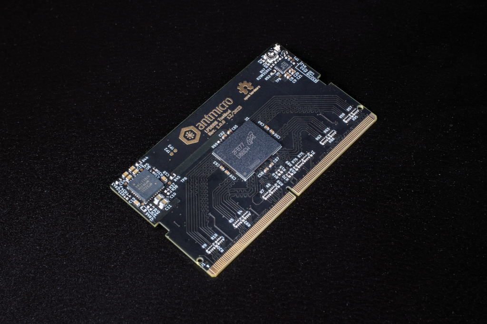

# LPDDR5 Test Bed

:::{figure-md} lpddr5-test-bed


LPDDR5 Test Bed
:::

This accessory allows to interface with a single LPDDR5 ICs using the [SO-DIMM DDR5 Tester](so_dimm_ddr5_tester).
The hardware design of the LPDDR5 Test Bed is released to GitHub (<https://github.com/antmicro/lpddr5-testbed>) as open source hardware.
The hardware design of the LPDDR5 Testbed includes a single Micron MT62F1G32D4DR-031 LPDDR5 IC.

```{warning}
The DDR5 Test Bed has a form factor that is mechanically compatible with SO-DIMM DDR4 sockets. 
The pinout of the DDR5 Test Bed does not match SO-DIMM DDR4 specification so it cannot be used in systems supporting off-the-shelf SO-DIMM DDR4 memories.
```
