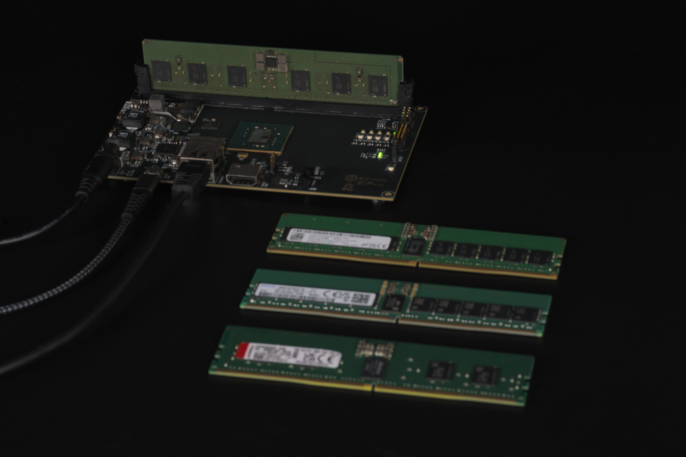

# Memory testing

This chapter provides a brief overview of memory validation and testing methodologies used for ensuring that the Rowhammer tester remains usable with various memory targets.

## CI driven testing

The digital [design targets](building_rowhammer) supported by the Rowhammer tester are periodically synthesized with a Continuous Integration system within Antmicro's internal infrastructure.
The synthesized designs (bitstreams) are then uploaded to physical testers orchestrated with CI runners.
You can read more about the hardware-in-the-loop testing methodology and Antmicro's Scalerunner project in this [blog note](https://antmicro.com/blog/2022/08/scalerunner-open-source-compute-cluster/).

The hardware platforms currently used in the CI-based testing are:

* [RDIMM DDR5 Tester Rev. 1.0](rdimm_ddr5_tester.md) with off-the-shelf `Micron MTC10F1084S1RC48BA1 NGCC` memory module installed.
* [SODIMM DDR5 Tester](so_dimm_ddr5_tester.md) with off-the-shelf `Micron MTC8C1084S1SC48BA1` memory module installed.
* [SODIMM DDR5 Tester](so_dimm_ddr5_tester.md) with [LPDD5 Testbed](lpddr5_test_bed.md) with `Micron MT62F1G32D4DR-031 WT:B` memory IC soldered.
* [LPDDR4 Tester](lpddr4_test_board.md) with [DDR5 Testbed](ddr5_test_bed.md) with `Micron MT60B2G8HB-48B` memory IC soldered.

## Manual testing

In order to increase test coverage with respect to a number of different off-the-shelf memory modules, semi-automated testing is performed.

:::{figure-md} rdimm-ddr5-memory-testing-setup


Memory testing setup for manual tests
:::

In this scenario the memory module under test is installed in one of the testers and verified with a `Memtest` routine.
The logs from the testing process are collected in a common storage bucket.
Based on the collected logs, a historical test coverage is evaluated.

The unified testing procedure consists of three short memory tests followed by one extended test:

1. Short Test
Run each of the following commands:
```bash
python3 rowhammer_tester/scripts/mem.py --srv --size 0x200000
```
Repeat this command three times to ensure consistency.

2. Extended Test
Run the following command:
```bash
python3 rowhammer_tester/scripts/mem.py --srv --size 0x800000
```

## RDIMM DDR5 test coverage

The following RDIMM DDR5 coverage table outlines the DDR5 RDIMM modules that have passed all of the above tests.
The table matches the memory module and the SHA of the latest Rowhammer tester commit that was used during the experimentation.

```{csv-table} RDIMM DDR5 test coverage
   :file: csv/coverage_table.csv
   :header-rows: 1
```
