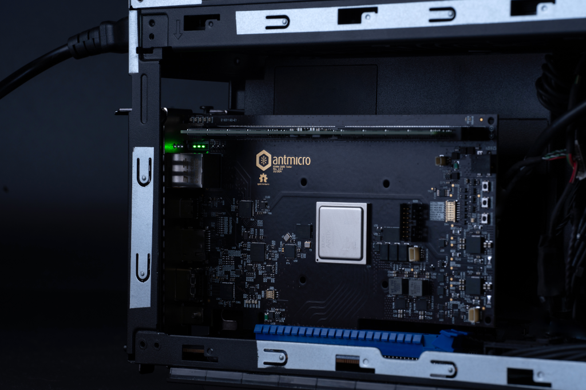

# PCIe support

The selected hardware platforms used for DRAM testing include optional PCIe interface break-routed from the on-board FPGA. 
Those platforms are [SO-DIMM DDR5 Tester](so_dimm_ddr5_tester.md) supporting PCIe x4 and [RDIMM DDR5 Tester](rdimm_ddr5_tester.md) in Revision 2.0 supporting PCIe x8. 
Those platforms were designed in a form of PCIe cards and are mechanically compliant with host platforms with PCIe root complex.

:::{figure-md} rdimm-ddr5-tester-pcie-integration


RDIMM DDR5 Tester connected to Intel NUC-series host PC over PCIe x8.
:::

Enabling PCIe interface in the digital design allows for fast data-exchange between the host PC, FPGA and the memory.

:::{note}

Enabling PCIe connectivity currently requires extending the existing the Rowhammer tester codebase with setup-specific features.
In particular PCIe requires mapping the API/commands into Rowhammer-specific API.

:::

## DRAM Bender integration

Table below presents command mapping for proposed for controling Payload Executor.
This mapping is common for all the DRAM variants.

```{include} csv/payload-executor-bender.md
```

Table below presents DRAM-specific command mappings proposed for Bender integration.


````{tab} DDR4
```{include} csv/dfi-ddr4-bender.md
```
````
````{tab} DDR5
```{include} csv/dfi-ddr5-bender.md
```
````
````{tab} LPDDR4
```{include} csv/dfi-lpddr4-bender.md
```
````
````{tab} LPDDR5
```{include} csv/dfi-lpddr5-bender.md
```
````
