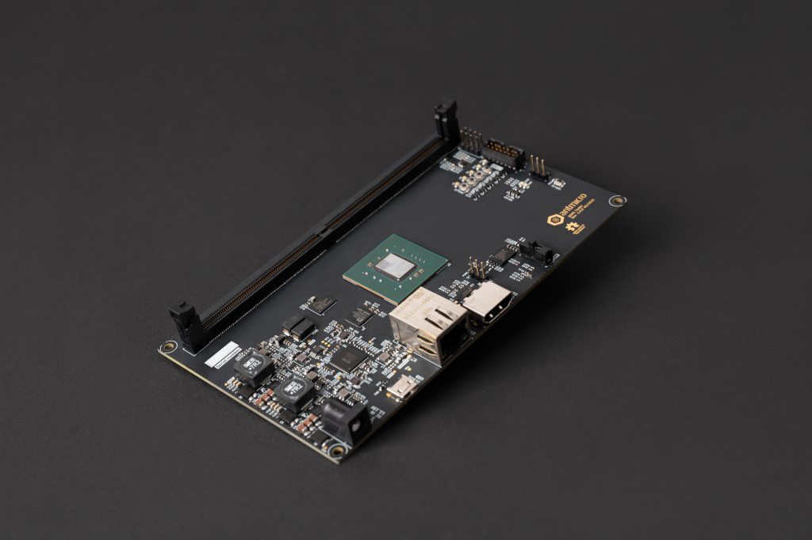

# RDIMM DDR5 Tester

The Data Center RDIMM DDR5 Tester is an open source hardware test platform that enables testing and experimenting with various DDR5 RDIMMs (Registered Dual In-Line Memory Module).

:::{figure-md} 


RDIMM DDR5 Tester in revision 1.x
:::

The hardware is open and can be found on [GitHub](https://github.com/antmicro/rdimm-ddr5-tester).

The following instructions explain how to set up the board.

For FPGA digital design documentation for this board, refer to the [Digital design](build/ddr5_test_board/documentation/index.rst) chapter.

## IO map

A map of on-board connectors, status LEDs, control buttons and I/O interfaces is provided in {numref}`rdimm-ddr5-tester-interface-map` below.

:::{figure-md} rdimm-ddr5-tester-interface-map


DDR5 tester interface map
:::

Connectors:

* [`J1`](#ddr5-tester_J1) - main DC barrel jack power connector, voltage between 12-15V is supported
* [`J6`](#ddr5-tester_J6) - USB Micro-B debug connector used for programming FPGA or Flash memory
* [`J3`](#ddr5-tester_J3) - standard 14-pin JTAG connector used for programming FPGA or Flash memory
* [`J5`](#ddr5-tester_J5) - HDMI connector
* [`J4`](#ddr5-tester_J4) - Ethernet connector used for data exchange with on-board FPGA
* [`U12`](#ddr5-tester_U12) - 288-pin RDIMM connector for connecting DDR5 memory modules
* [`MODE1`](#ddr5-tester_MODE1) - configuration mode selector, short proper pins with jumper to specify programming mode
* [`J2`](#ddr5-tester_J2) - optional 5V fan connector
* [`J7`](#ddr5-tester_J7) - socket for SD card
* `J8` - 2.54mm goldpin connector with exposed I2C and I3C signals

Switches and buttons:

* Power ON/OFF button [`S1`](#ddr5-tester_S1) - slide up to power up a device, slide down to turn off the device
* FPGA programming button [`PROG_B1`](#ddr5-tester_PROG_B1) - push button to start programming from Flash
* 4x User button ([`PROG_B2`](#ddr5-tester_PROG_B2), [`PROG_B3`](#ddr5-tester_PROG_B3), [`PROG_B4`](#ddr5-tester_PROG_B4), [`PROG_B5`](#ddr5-tester_PROG_B5)) - user-configurable buttons

LEDs:

* 3V3 Power indicator [`PWR1`](#ddr5-tester_PWR1) - indicates presence of stabilized 3.3V voltage
* FPGA programming INIT [`D6`](#ddr5-tester_D6) - indicates current FPGA configuration state
* FPGA programming DONE [`D5`](#ddr5-tester_D5) - indicates completion of FPGA programming
* 5x User ([`D7`](#ddr5-tester_D7), [`D8`](#ddr5-tester_D8), [`D9`](#ddr5-tester_D9), [`D10`](#ddr5-tester_D10), [`D11`](#ddr5-tester_D11)) - user-configurable LEDs

## Rowhammer Tester Target Configuration

Connect power supply (12-15VDC) to the [`J1`](#ddr5-tester_J1) barrel jack.
Then connect the board USB cable ([`J6`](#ddr5-tester_J6)) and Ethernet cable ([`J4`](#ddr5-tester_J4)) to your computer and insert the memory module to the socket [`U12`](#ddr5-tester_U12).
To turn on the board, use the power switch [`S1`](#ddr5-tester_S1).
After power is up, configure the network and upload the bitstream.

There is a JTAG/SPI switch ([`MODE1`](#ddr5-tester_MODE1)) on the right-hand side of the board.
Unless it's set to the SPI setting, the FPGA will load the bitstream received via JTAG ([`J3`](#ddr5-tester_J3)).

The bitstream will be loaded from flash memory upon device power-on or after pressing the [`PROG_B1`](#ddr5-tester_PROG_B1) button.

## Simulation

The simulation is based on a DDR5 DRAM model ([sdram_simulation_model.py](https://github.com/antmicro/litedram/blob/rowhammer-tester/litedram/phy/ddr5/sdram_simulation_model.py)) and a DDR5 PHY simulation model ([simphy.py](https://github.com/antmicro/litedram/blob/rowhammer-tester/litedram/phy/ddr5/simphy.py)).
These models are used by the SoC simulation model ([simsoc.py](https://github.com/antmicro/litedram/blob/rowhammer-tester/litedram/phy/ddr5/simsoc.py)).

Start the simulation with:

```sh
python3 third_party/litedram/litedram/phy/ddr5/simsoc.py --no-masked-write --with-sub-channels --dq-dqs-ratio 4 --modules-in-rank 1 --log-level error --skip-csca --skip-reset-seq --skip-mrs-seq --with-prompt --l2-size 256 --uart-name serial
```
