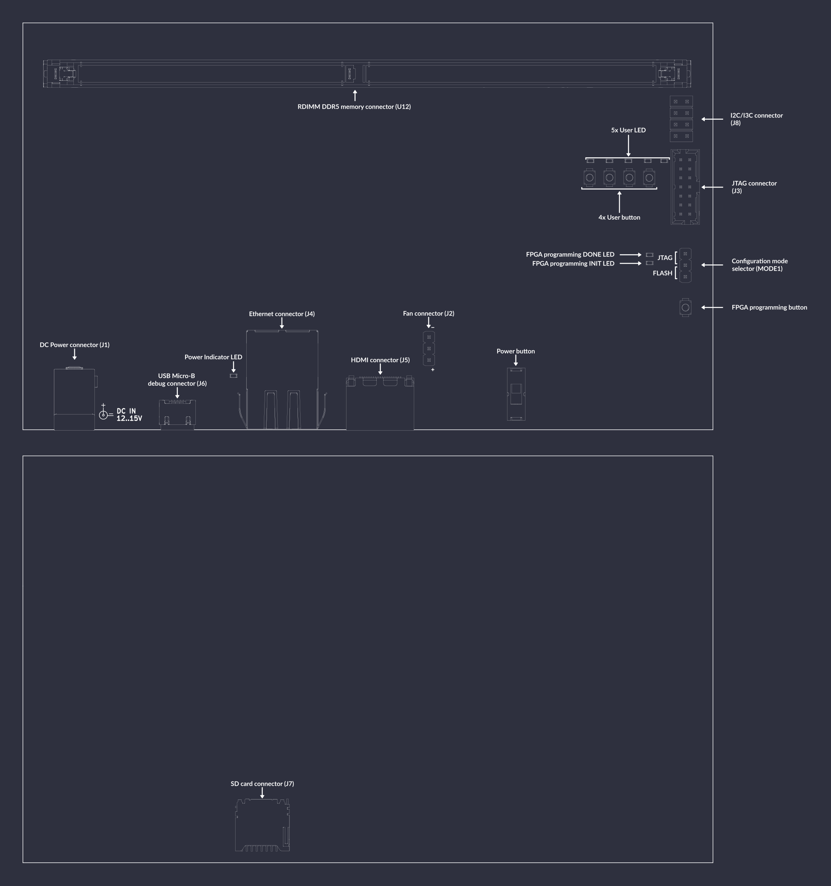

# RDIMM DDR5 Tester

The RDIMM DDR5 Tester is an open source hardware test platform that enables testing and experimenting with various DDR5 RDIMMs (Registered Dual In-Line Memory Module).

The hardware is open and can be found on [GitHub](https://github.com/antmicro/rdimm-ddr5-tester).

For FPGA gateware documentation for this board, refer to the [Gateware Documentation chapter](build/ddr5_test_board/documentation/index.rst).

## Variants

The latest design revision (Rev. 2.0) is based on AMD (Xilinx) UltraScale Plus FPGA which offers more logic resources operating at higher throughput. A more detailed comparison between Kintex-7 and UltraScale Plus RDIMM DDR5 Tester can be found in this [blog note](https://antmicro.com/blog/2024/12/data-center-rdimm-ddr5-tester-2-0/).

````{tab} Revision 2.0

:::{figure-md} rdimm-ddr5-tester-2.0.0


RDIMM DDR5 Tester in revision 2.0.0
:::
````
````{tab} Revision 1.0

:::{figure-md} rdimm-ddr5-tester-1.0.0


RDIMM DDR5 Tester in revision 1.0.0
:::
````

## IO map

````{tab} Revision 2.0

A map of on-board connectors, status LEDs, control buttons and I/O interfaces is provided in {numref}`rdimm-ddr5-tester-2.0.0-interface-map` below.

:::{figure-md} rdimm-ddr5-tester-2.0.0-interface-map


DDR5 tester interface map
:::

Connectors:

* [`J7`](#rdimm-ddr5-tester-2.0.0_J7) - main DC barrel jack power connector, voltage between 7-15 V is supported
* [`J3`](#rdimm-ddr5-tester-2.0.0_J3) - USB-C debug connector used for programming FPGA or Flash memory
* [`J4`](#rdimm-ddr5-tester-2.0.0_J4) - HDMI output connector
* [`J11`](#rdimm-ddr5-tester-2.0.0_J11) - HDMI input connector
* [`J6`](#rdimm-ddr5-tester-2.0.0_J6) - Ethernet connector used for data exchange with on-board FPGA
* [`J2`](#rdimm-ddr5-tester-2.0.0_J2) - 288-pin RDIMM connector for connecting DDR5 memory modules
* [`J8`](#rdimm-ddr5-tester-2.0.0_J8) - optional 5V fan connector
* [`J5`](#rdimm-ddr5-tester-2.0.0_J5) - socket for SD card
* [`J12`](#rdimm-ddr5-tester-2.0.0_J12) - I2C/I3C connector
* [`J17`](#rdimm-ddr5-tester-2.0.0_J17) - Heater connector (maximum 10W)
* `J1` - optionally mounted standard 14-pin JTAG connector used for programming FPGA or Flash memory

Switches and buttons:

* Power button [`SW5`](#rdimm-ddr5-tester-2.0.0_SW5) - push button to power up the device, push button again to turn the device off
* FPGA programming button [`SW2`](#rdimm-ddr5-tester-2.0.0_SW2) - push button to start programming from Flash
* PCIe present selector [`SW1`](#rdimm-ddr5-tester-2.0.0_SW1) - switch slide to set PCIe present to X1, X4 and X8
* HOT SWAP eject button [`SW3`](#rdimm-ddr5-tester-2.0.0_SW3) - reserved for future use to turn off DDR memory and allow hot swapping it
* Config switch [`SW4`](#rdimm-ddr5-tester-2.0.0_SW4) - switch for setting several configuration options (options described later)

LEDs:

* Power good indicator [`D1`](#rdimm-ddr5-tester-2.0.0_D1) - indicates presence of all FPGA voltage rails stabilized
* FPGA programming INIT [`D2`](#rdimm-ddr5-tester-2.0.0_D2) - indicates current FPGA configuration state
* FPGA programming DONE [`D3`](#rdimm-ddr5-tester-2.0.0_D3) - indicates completion of FPGA programming
* 5x User ([`D8`](#rdimm-ddr5-tester-2.0.0_D8), [`D7`](#rdimm-ddr5-tester-2.0.0_D7), [`D6`](#rdimm-ddr5-tester-2.0.0_D6), [`D5`](#rdimm-ddr5-tester-2.0.0_D5), [`D4`](#rdimm-ddr5-tester-2.0.0_D4)) - user-configurable LEDs
* VBULK indicator [`D21`](#rdimm-ddr5-tester-2.0.0_D21) - indicates presence of VBULK DDR5 voltage rail stabilized
* VMGT indicator [`D22`](#rdimm-ddr5-tester-2.0.0_D22) - indicates presence of VMGT DDR5 voltage rail stabilized
````
````{tab} Revision 1.0

A map of on-board connectors, status LEDs, control buttons and I/O interfaces is provided in {numref}`rdimm-ddr5-tester-1.0.0-interface-map`.

:::{figure-md} rdimm-ddr5-tester-1.0.0-interface-map


DDR5 tester interface map
:::

Connectors:

* [`J1`](#rdimm-ddr5-tester-1.0.0_J1) - main DC barrel jack power connector, voltage between 12-15V is supported
* [`J6`](#rdimm-ddr5-tester-1.0.0_J6) - USB Micro-B debug connector used for programming FPGA or Flash memory
* [`J3`](#rdimm-ddr5-tester-1.0.0_J3) - standard 14-pin JTAG connector used for programming FPGA or Flash memory
* [`J5`](#rdimm-ddr5-tester-1.0.0_J5) - HDMI connector
* [`J4`](#rdimm-ddr5-tester-1.0.0_J4) - Ethernet connector used for data exchange with on-board FPGA
* [`U12`](#rdimm-ddr5-tester-1.0.0_U12) - 288-pin RDIMM connector for connecting DDR5 memory modules
* [`MODE1`](#rdimm-ddr5-tester-1.0.0_MODE1) - configuration mode selector, short proper pins with jumper to specify programming mode
* [`J2`](#rdimm-ddr5-tester-1.0.0_J2) - optional 5V fan connector
* [`J7`](#rdimm-ddr5-tester-1.0.0_J7) - socket for SD card
* `J8` - 2.54mm goldpin connector with exposed I2C and I3C signals

Switches and buttons:

* Power ON/OFF button [`S1`](#rdimm-ddr5-tester-1.0.0_S1) - slide up to power up a device, slide down to turn off the device
* FPGA programming button [`PROG_B1`](#rdimm-ddr5-tester-1.0.0_PROG_B1) - push button to start programming from Flash
* 4x User button ([`PROG_B2`](#rdimm-ddr5-tester-1.0.0_PROG_B2), [`PROG_B3`](#rdimm-ddr5-tester-1.0.0_PROG_B3), [`PROG_B4`](#rdimm-ddr5-tester-1.0.0_PROG_B4), [`PROG_B5`](#rdimm-ddr5-tester-1.0.0_PROG_B5)) - user-configurable buttons

LEDs:

* 3V3 Power indicator [`PWR1`](#rdimm-ddr5-tester-1.0.0_PWR1) - indicates presence of stabilized 3.3V voltage
* FPGA programming INIT [`D6`](#rdimm-ddr5-tester-1.0.0_D6) - indicates current FPGA configuration state
* FPGA programming DONE [`D5`](#rdimm-ddr5-tester-1.0.0_D5) - indicates completion of FPGA programming
* 5x User ([`D7`](#rdimm-ddr5-tester-1.0.0_D7), [`D8`](#rdimm-ddr5-tester-1.0.0_D8), [`D9`](#rdimm-ddr5-tester-1.0.0_D9), [`D10`](#rdimm-ddr5-tester-1.0.0_D10), [`D11`](#rdimm-ddr5-tester-1.0.0_D11)) - user-configurable LEDs

````

## Rowhammer Tester Target Configuration

The following instructions explain how to set up the board depending on the revision you have.

````{tab} Revision 2.0
Set the config switch [`SW4`](#rdimm-ddr5-tester-2.0.0_SW4) in proper positions.
The possible options are:

* PB- CTRL - automatically turn on board or use power button [`SW5`](#rdimm-ddr5-tester-2.0.0_SW5)
* INSTANT OFF - pushing power button [`SW5`](#rdimm-ddr5-tester-2.0.0_SW5) will turn off device instantly or after 8s
* I2C MUX IN1 - configure switch of I2C on board (described below)
* I2C MUX IN2 - configure switch of I2C on board (described below)
* JTAG/ SPI Flash - boot mode switch
* USER IN - User configurable input
* QDCDC2 I2C - enable I2C in main DCDC converter
* FTDI JTAG OFF - disable on-board FTDI which communicates with FPGA and Flash memory via JTAG

Configure power-up of I2C on board:

| PWR I2C | IN1 | IN2 |
| ------- | --- | --- |
| OFF | L | L |
| FPGA DDR I2C | H | L |
| FPGA PWR I2C | L | H |
| FTDI | H | H |
````
````{tab} Revision 1.0

Connect power supply (12-15VDC) to the [`J1`](#rdimm-ddr5-tester-1.0.0_J1) barrel jack.
Then connect the board USB cable ([`J6`](#rdimm-ddr5-tester-1.0.0_J6)) and Ethernet cable ([`J4`](#rdimm-ddr5-tester-1.0.0_J4)) to your computer and insert the memory module to the socket [`U12`](#rdimm-ddr5-tester-1.0.0_U12).
To turn on the board, use the power switch [`S1`](#rdimm-ddr5-tester-1.0.0_S1).
After power is up, configure the network and upload the bitstream.

There is a JTAG/SPI switch ([`MODE1`](#rdimm-ddr5-tester-1.0.0_MODE1)) on the right-hand side of the board.
Unless it's set to the SPI setting, the FPGA will load the bitstream received via JTAG ([`J3`](#rdimm-ddr5-tester-1.0.0_J3)).

The bitstream will be loaded from flash memory upon device power-on or after pressing the [`PROG_B1`](#rdimm-ddr5-tester-1.0.0_PROG_B1) button.
````

## Simulation

The simulation is based on a DDR5 DRAM model ([sdram_simulation_model.py](https://github.com/antmicro/litedram/blob/rowhammer-tester/litedram/phy/ddr5/sdram_simulation_model.py)) and a DDR5 PHY simulation model ([simphy.py](https://github.com/antmicro/litedram/blob/rowhammer-tester/litedram/phy/ddr5/simphy.py)).
These models are used by the SoC simulation model ([simsoc.py](https://github.com/antmicro/litedram/blob/rowhammer-tester/litedram/phy/ddr5/simsoc.py)).

Start the simulation with:

```sh
python3 third_party/litedram/litedram/phy/ddr5/simsoc.py --no-masked-write --with-sub-channels --dq-dqs-ratio 4 --modules-in-rank 1 --log-level error --skip-csca --skip-reset-seq --skip-mrs-seq --with-prompt --l2-size 256 --uart-name serial
```
## RDIMM DDR5 Memory Testing Procedure


This chapter provides a comprehensive guide to performing memory tests. The memory testing process is designed to validate the integrity and performance of various memory modules. 
This procedure employs unified testing scenario involving three short tests and one extended test to ensure thorough evaluation.

### Tools and Equipment
The following tools and equipment are required for the memory testing procedure:

|   | Item | Manufacturer | MPN |
|---|-------------------|----------|--------------|
| 1 | RDIMM DDR5 Tester | Antmicro | 071.yyy.zzzz |
| 2 | DDR5 RDIMM | DUT(Device under test) | - |
| 2 | USB C Hub with network adapter | i-tec | C31METALG3HUB |
| 3 | RJ-45 cat 6a cable | Goobay | 91582 |
| 4 | USB C cable | Goobay | 41073 |
| 6 | USB C to USB A adapter (optional) | i-tec | C31TYPEA |

* Where y is board revision and z is unique unit number

---

### Procedure for Running Memory Tests

#### Prepare testing platform

TODO:link chapters

This is the step by step guide for testing memory modules:

1. First follow the instructions in [Installation and setup](installation-and-setup) and [Building Rowhammer Design](building-rowhammer-design) chapters.
2. Install DDR5 RDIMM module into the designated slot [`U12`](#ddr5-tester_U12) on RDIMM DDR5 Tester.
3. Make sure that Power, USB and Ethernet cables are connected
4. Turn on the Tester with the `POWER` switch 
5. Make sure that Network USB adapter is configured properly
6. Activate venv	
```bash
source venv/bin/activate
```
7. Flash the board
```bash
make upload
```
(Upload to SRAM) or 

```bash
make flash
```
(Write to (Q)SPI Flash memory) - To start from flash please ensure that [`MODE1`](#ddr5-tester_MODE1) jumper is set to `FLASH`


#### Running Memory Tests

The unified testing procedure consists of three short memory tests followed by one extended test:

1. Short Test
Run each of the following commands:
```bash
python3 rowhammer_tester/scripts/mem.py --srv --size 0x200000
```
Repeat this command three times to ensure consistency.

2. Extended Test
Run the following command:
```bash
python3 rowhammer_tester/scripts/mem.py --srv --size 0x800000
```
This test takes longer to execute and provides an in-depth analysis of memory behavior under stress.

---

#### Testing Parameters and Their Purpose
The following parameters are used in the testing scripts:

| Parameter        | Description                                                                          |
|------------------|--------------------------------------------------------------------------------------|
| `--srv`          | Program will start its own instance of litex_server                                 |
| `--size`         | Specifies the memory size to be tested. For short tests, 0x200000 is used.           |
|                  | For extended tests, 0x800000 is specified to a larger memory range.                  |

These parameters ensure a balance between execution time and test coverage, providing reliable validation of memory integrity.

---

### RDIMM DDR5 Coverage Table
The following table outlines the DDR5 RDIMM modules that have passed all of the above tests.

TODO: Include CSV table
