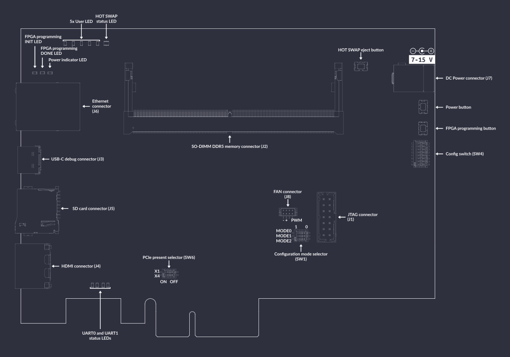

# SO-DIMM DDR5 Tester

:::{figure-md} so-dimm-ddr5-tester


SO-DIMM DDR5 Tester
:::

The SO-DIMM DDR5 tester is an open source hardware test platform that enables testing and experimenting with various DDR5 SO-DIMM modules and Antmicro LPDDR5 testbed.

The hardware is open and can be found on GitHub:
<https://github.com/antmicro/sodimm-ddr5-tester>

For FPGA digital design documentation for this board, refer to the [Digital design](build/ddr5_tester/documentation/index.rst) chapter.

## IO map

A map of on-board connectors, status LEDs, control buttons and I/O interfaces is provided in {numref}`sodimm-ddr5-tester-interface-map` below.

:::{figure-md} sodimm-ddr5-tester-interface-map


SO-DIMM DDR5 tester interface map
:::

Connectors:

* [`J7`](#sodimm-ddr5-tester_J7) - main DC barrel jack power connector, voltage between 7-15 V is supported
* [`J3`](#sodimm-ddr5-tester_J3) - USB-C debug connector used for programming FPGA or Flash memory
* `J1`#sodimm-ddr5-tester_J1 - standard 14-pin JTAG connector used for programming FPGA or Flash memory
* [`J4`](#sodimm-ddr5-tester_J4) - HDMI connector
* [`J6`](#sodimm-ddr5-tester_J6) - Ethernet connector used for data exchange with on-board FPGA
* [`J2`](#sodimm-ddr5-tester_J2) - 262-pin SO-DIMM connector for connecting DDR5 memory modules
* [`J8`](#sodimm-ddr5-tester_J8) - optional 5V fan connector
* [`J5`](#sodimm-ddr5-tester_J5) - socket for SD card

Switches and buttons:

* Power button [`SW5`](#sodimm-ddr5-tester_SW5) - push button to power up the device, push button again to turn the device off
* Configuration mode selector [`SW1`](#sodimm-ddr5-tester_SW1) - switch proper slides to specify programming mode (options described later)
* FPGA programming button [`SW2`](#sodimm-ddr5-tester_SW2) - push button to start programming from Flash
* PCIe present selector [`SW6`](#sodimm-ddr5-tester_SW6) - switch slide to set PCIe present to X1 and X4
* HOT SWAP eject button [`SW3`](#sodimm-ddr5-tester_SW3) - reserved for future use to turn off DDR memory and allow hot swapping it
* Config switch [`SW4`](#sodimm-ddr5-tester_SW4) - switch for setting several configuration options (options described later)

LEDs:

* 3V3 Power indicator [`D1`](#sodimm-ddr5-tester_D1) - indicates presence of stabilized 3.3V voltage
* FPGA programming INIT [`D3`](#sodimm-ddr5-tester_D3) - indicates current FPGA configuration state
* FPGA programming DONE [`D2`](#sodimm-ddr5-tester_D2) - indicates completion of FPGA programming
* 5x User ([`D4`](#sodimm-ddr5-tester_D4), [`D5`](#sodimm-ddr5-tester_D5), [`D6`](#sodimm-ddr5-tester_D6), [`D7`](#sodimm-ddr5-tester_D7), [`D8`](#sodimm-ddr5-tester_D8)) - user-configurable LEDs
* HOT SWAP status [`D9`](#sodimm-ddr5-tester_D9) - RGY LED indicating status of hot swap process
* UART0 and UART1 status ([`D10`](#sodimm-ddr5-tester_D10), [`D11`](#sodimm-ddr5-tester_D11), [`D12`](#sodimm-ddr5-tester_D12), [`D13`](#sodimm-ddr5-tester_D13)) - indicates status of RX/TX lines of UART protocols

## Rowhammer Tester Target Configuration

The following instructions explain how to set up the board.

Set configuration mode selectors [`SW1`](#sodimm-ddr5-tester_SW1) in proper positions.
Using these 3 switches, you can set the following modes:

| Configuration mode | MODE[2] | MODE[1] | MODE[0] |
|--------------------|---------|---------|---------|
| Master Serial      | 0       | 0       | 0       |
| Master SPI         | 0       | 0       | 1       |
| Master BPI         | 0       | 1       | 0       |
| Master SelectMAP   | 1       | 0       | 0       |
| JTAG               | 1       | 0       | 1       |
| Slave SelectMAP    | 1       | 1       | 0       |
| Slave Serial       | 1       | 1       | 1       |

For JTAG programming, set `JTAG` mode.
If the bitstream needs to be loaded from the Flash memory, select `Master SPI` mode.
This configuration is set by default.
The bitstream will be loaded from flash memory upon device power-on or after a [`SW2`](#sodimm-ddr5-tester_SW2) button press.

Set config switch [`SW4`](#sodimm-ddr5-tester_SW4) in proper positions.
The possible options are:

* PB- CTRL - automatically turn on board or use power button [`SW5`](#sodimm-ddr5-tester_SW5)
* INSTANT OFF - pushing power button [`SW5`](#sodimm-ddr5-tester_SW5) will turn off device instantly or after 8s
* I2C MUX IN1 - configure switch of I2C on board (described below)
* I2C MUX IN2 - configure switch of I2C on board (described below)
* PWR I2C SDA - disable I2C in 3V3 powered IC's
* PWR I2C SCL - disable I2C in 3V3 powered IC's
* QDCDC2 I2C - enable I2C in main DCDC converter
* FTDI JTAG OFF - disable on-board FTDI which communicates with FPGA and Flash memory via JTAG

Configure power-up of I2C on board:

| PWR I2C | IN1 | IN2 |
| ------- | --- | --- |
| OFF | L | L |
| FPGA DDR I2C | H | L |
| FPGA PWR I2C | L | H |
| FTDI | H | H |

Connect power supply (7-15VDC) to [`J7`](#sodimm-ddr5-tester_J7) barrel jack.
Then connect the board's USB-C [`J3`](#sodimm-ddr5-tester_J3) and Ethernet [`J6`](#sodimm-ddr5-tester_J6) interfaces to your computer, insert the memory module into the [`J2`](#sodimm-ddr5-tester_J2) socket and turn it on using power switch [`SW5`](#sodimm-ddr5-tester_SW5).
Then configure the network.
The board's default IP address is `192.168.100.50` and you need to ensure the device are registered within the same subnet (so, for example, you can use `192.168.100.2/24`).
The `IP_ADDRESS` environment variable can be used to modify the board's address.
Next, generate the FPGA bitstream:

```sh
export TARGET=sodimm_ddr5_tester
make build TARGET_ARGS="--l2-size 256 --build --iodelay-clk-freq 400e6 --bios-lto --rw-bios --no-sdram-hw-test"
```

```{note}
`--l2-size 256` sets L2 cache size to 256 bytes

`--no-sdram-hw-test` disables hw accelerated memory test
```

```{note}
Running `make`  will generate build files without invoking Vivado.
```

The results will be located in: `build/sodimm_ddr5_tester/gateware/antmicro_sodimm_ddr5_tester.bit`. To upload the bitstream, use:

```sh
export TARGET=sodimm_ddr5_tester
make upload
```

To save the bitstream in flash memory, use:

```sh
export TARGET=sodimm_ddr5_tester
make flash
```
