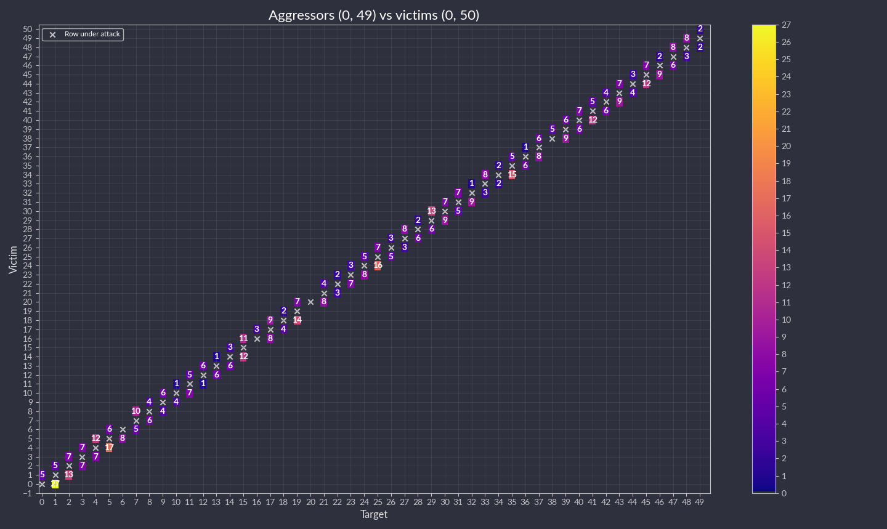
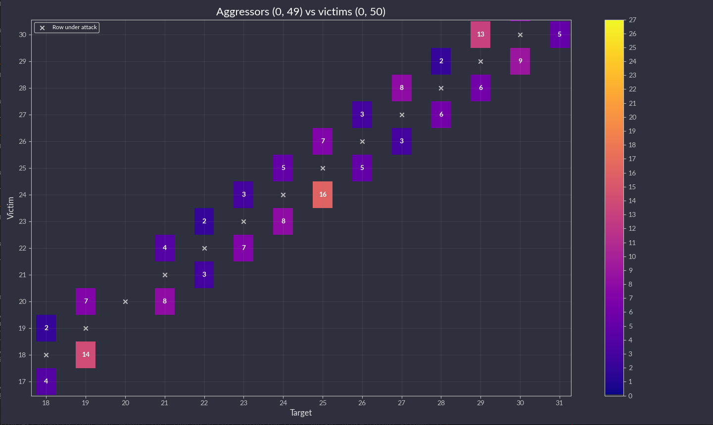
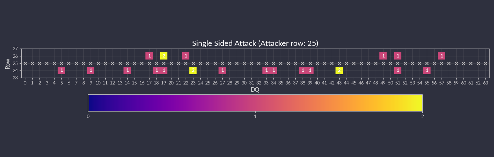

# Result visualization

When you executed some attacks on your board, you can use the results to draw a plot or visualize them with python and matplotlib or with the [F4PGA Database Visualizer](https://github.com/chipsalliance/f4pga-database-visualizer).
This chapter describes scripts used for visualizing the rowhammer attacks.
The script accept json files that can be generated as a result of hammering with commands described in the {doc}`hammering` chapter.

## Plot bitflips - `logs2plot.py`

This script can plot graphs based on generated logs.
It can generate two different types of graphs:

1. Distribution of bitflips across rows and columns. For example, you can generate graphs by calling:

   ```sh
      (venv) $ python logs2plot.py your_error_summary.json
   ```

   One graph will be generated for every attack.
   So if you attacked two row pairs `(A, B)`, `(C, D)` with two different read counts each `(X, Y)`, for a total of 4 attacks, you will get 4 plots:

   * read count: `X` and pair: `(A, B)`
   * read count: `X` and pair: `(C, D)`
   * read count: `Y` and pair: `(A, B)`
   * read count: `Y` and pair: `(C, D)`

   You can control the number of displayed columns with `--plot-columns`.
   For example if your module has 1024 columns and you provide `--plot-columns 16`, then the DRAM columns will be displayed in groups of 64.

2. Distribution of rows affected by bitflips when targeting single rows. For example, you can generate a graph by calling:

   ```sh
      (venv) $ python logs2plot.py --aggressors-vs-victims your_error_summary.json
   ```

   One graph will be generated with victims (affected rows) on the Y axis and aggressors (attacking rows) on the X axis.
   The row under attack is marked with `X` symbol.
   The affected rows (victims) above and below the row under attack (agsressor) include cells with number of bit flips detected.
   The colors of the tiles indicate how many bitflips occurred for each victim.

   You can enable additional annotation with `--annotate bitflips` so that the number of occurred bitflips will be explicitly labeled on top of each victim tile.
   {numref}`plot-annotation` presents a set of bitflips recorded while hammering rows `1-50` of `bank 0` in  `SK hynix HMCG84MEBRA112NBB`
 from off-the-shelf RDIMM DDR5 memory under test.

   :::{figure-md} plot-annotation
   

   Example plot generated with annotation enabled
   :::

   You can zoom in on interesting parts by using matplotlib's zoom tool (in the bottom left corner):

   :::{figure-md} annotation-zoom
   

   Zooming in on the plot
   :::

   This type of plot has built-in DQ per pad statistics for each attack. 
   After clicking a specific tile you will see a new pop-up window with a plot:

   :::{figure-md} dq-pop-up
   

   Per pad statistics
   :::

## Plot per DQ pad - `logs2dq.py`

This script allows you to visualize bitflips and group them per DQ pad.
Pads themselves are grouped using colors to differentiate modules.
With this script, you can visualize and check which module is failing the most.

By default, it displays mean bitflips across all attacks with standard deviation.

First, run `rowhammer.py` or `hw_rowhammer.py` with the `--log-dir log_directory` flag.

Then run:

```sh
python3 logs2dq.py log_directory/your_error_summary.json
```

You can also pass optional arguments:

* `--dq DQ` - how many pads are connected to one module
* `--per-attack` - allows you to also view DQ groupings for each attacked pair of rows

## Use F4PGA Visualizer - `logs2vis.py`

Similarly as in `logs2plot.py`, you can generate visualizations using the [F4PGA Database Visualizer](https://github.com/chipsalliance/f4pga-database-visualizer).

To view results using the visualizer you need to:

1. Clone and build the visualizer:

   ```sh
   git clone https://github.com/chipsalliance/f4pga-database-visualizer
   cd f4pga-database-visualizer
   npm run build
   ```

2. Run `rowhammer.py` or `hw_rowhammer.py` with `--log-dir log_directory`.

3. Generate JSON files for the visualizer:

   ```sh
   python3 logs2vis.py log_directory/your_error_summary.json vis_directory
   ```

4. Copy generated JSON files from `vis_directory` to `/path/to/f4pga-database-visualizer/dist/production/`.

5. Start a simple HTTP server inside the production directory:

   ```sh
   python -m http.server 8080
   ```

An example output generated with the `--aggresors-vs-victims` flag looks like so:

:::{figure-md} aggresors-vs-victims-output


Agressors vs. victims flag output example
:::
